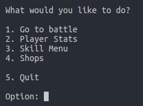
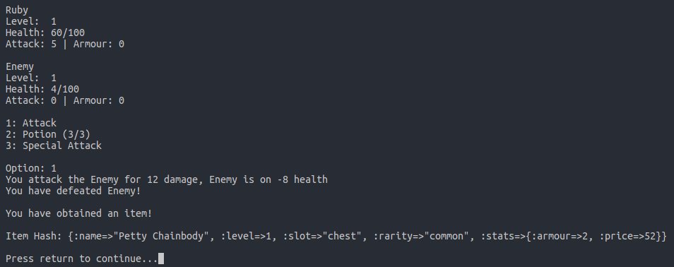
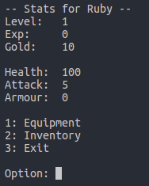
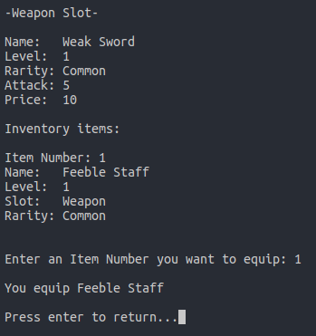
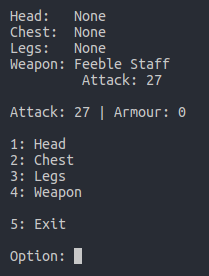

# Turn Based Game
A simple turn-based I wrote in Ruby (2.5.1).

## Working Features
+ Turn-based battle against an enemy (still need to add randomization algorithm, only 1 enemy that has static stats at the moment).
+ Inventory system.
+ Equipment system that allows swapping items
  - Slots: Head, Chest, Legs and Weapon.
+ Loot system with randomized names, stats, type and rarities based on the player's level (Awarded after a battle).
+ Save game feature.
  - Save game is located in `$HOME/.tbg/Saves/<player_name>` (Player's name is Ruby by default)

# How to play?
Once you've clone this repository, `cd` into it's directory and run the terminal command `ruby main.rb`.

# Screenshots
## Main Menu:
  
 
## In Battle:
  
 
## Player Stats:
  
 
## Equipping Items:
    
 
## Current Equipment Menu:
  